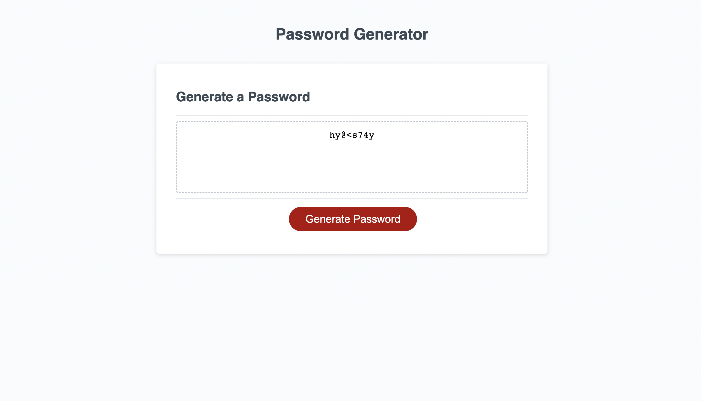

# Password-Generator

## Description

This website was made to generate a secure password using parameters of your own choosing including the length of the password and the types of characters used. This is important because a password is the only protection many people have from losing important documents and informatuion online so you need to make sure that it is secure and random so that no one can guess the password based on your own personal bias.

## Installation

N/A

## Usage

To begin making your password you first begin by clicking the button "generate password". You will then recieve a prompt asking how many characters you would like the password to have (from 8-128). After typing in a valid input and clicking ok on the prompt, you will then recieve another prompt asking you if you want numbers in your password. To say yes you can either type "yes", "y", "true", or "t". It is not case sensitive. After clicking ok you then move on to the next prompt asking about lower case letters. After you answer that you will recive two more prompts asking about upper case letters and special characters. To fill the prompts it is the same steps as for the previous two. After completing each prompt, a password that is generated randomly will then be ouput on your screen in the textbox.

link: https://masteroogway489.github.io/Password-Generator/

## Credits

N/A

## License

Refer to LICENCE in repo.
